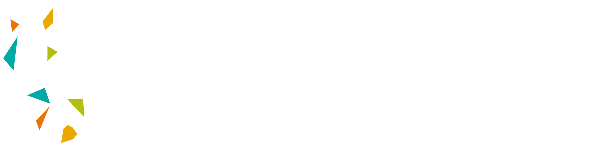

# KAUST Academy Artificial Intelligence Summer 2025 - MOI

This is the base Repository for the KAUST Academy Summer School that will be held in two locations in the for MOI Part time masters students.

1. King Abdullah University of Science and Technology (KAUST)
2. University of Oxford

## Program Overview

The KAUST Academy Artificial Intelligence Summer School 2025 is designed to provide participants with an in-depth understanding of key AI domains, including Computer Vision, Reinforcement Learning, and Natural Language Processing.

## Instructors

- KAUST:
  - [Dr. Wenxuan Zhang](https://www.linkedin.com/in/wenxuan-zhang-0960b11b8/?originalSubdomain=sa)
    - Week 1
  - [Dr. Kerven Durdymyradov](https://www.linkedin.com/in/kerven-durdymyradov/)
    - Week 2
- Oxford
  - [Prof. Naeemullah Khan](https://www.linkedin.com/in/profkhan/?originalSubdomain=sa)
  - [Dr. Tanveer Hussain](https://www.linkedin.com/in/tinu445/)
  - [Dr. Salman Khan](https://www.linkedin.com/in/salman-khan-240aab109/?originalSubdomain=uk)
  - [Dr. Muhammad Mubashar](https://www.linkedin.com/in/muhammad-mubashar-719b05167/)
  - [Dr. Ana Deligny](https://ori.ox.ac.uk/people/ana-deligny/)

## Teaching Assistants

- [Abdulelah Khalaf](https://www.linkedin.com/in/abdulelah-khalaf-b3b8942b5/)
- [Abdulrahman Omar](https://www.linkedin.com/in/abdulrahmanomar574b07216/?originalSubdomain=sa)
- [Hamza Alkaf](https://www.linkedin.com/in/hamza-alkaf-aaaa76317/?originalSubdomain=sa)
- [Iyas Baroud](https://www.linkedin.com/in/iyas-baroud/?originalSubdomain=sa)
- [Ali Habibullah](https://www.linkedin.com/in/ali-habibullah/)

Maintained by The Teaching Team
